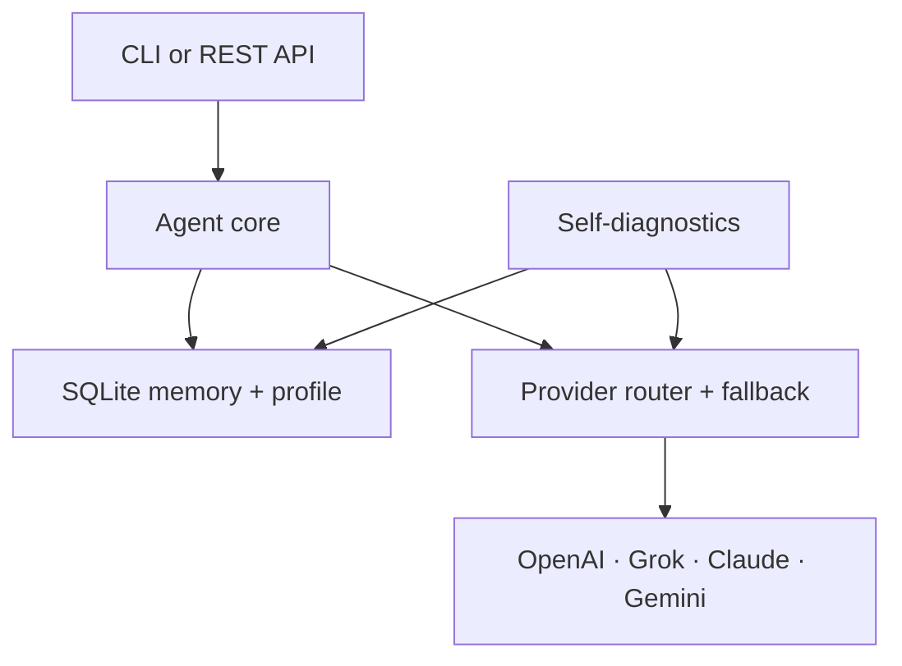

# Lemono Agent 🍋

Lemono is a local-first personal AI agent that remembers, checks its own health, and adapts to each user without silently rewriting its code or expanding its permissions.

## MVP features

- **Multi-model routing:** OpenAI/Codex, xAI Grok, Anthropic Claude, and Google Gemini behind one interface
- **Durable memory:** local SQLite + FTS5 retrieval with user isolation, provenance, confidence, and complete deletion
- **Safe personal evolution:** learns only explicit preferences and injects the user profile on future turns
- **Self-diagnostics:** database, provider configuration, and disk checks via CLI or API
- **Resilience:** ordered provider fallback with bounded HTTP timeouts
- **Local-first security:** no telemetry, no shell tools, non-root hardened container, restricted CORS

The design takes inspiration from the public ideas behind Hermes Agent—persistent memory, learning loops, self-hosting, skills, gateways, and automation—while remaining an independent implementation. The current milestone deliberately focuses on a small, auditable core.

## Quick start

```bash
python -m venv .venv
source .venv/bin/activate
pip install -e '.[dev]'
cp .env.example .env
# Add at least one API key to .env
lemono --doctor
lemono --provider claude
```

Run the API:

```bash
uvicorn lemono.api:app --reload
curl http://localhost:8000/v1/diagnostics
curl -X POST http://localhost:8000/v1/chat \
  -H 'content-type: application/json' \
  -d '{"user_id":"local","message":"답변은 간결하게 해줘"}'
```

Or use Docker:

```bash
cp .env.example .env
docker compose up --build
```

OpenAPI documentation is available at `http://localhost:8000/docs`.

## Provider configuration

| Provider | `provider` value | Key | Example default model |
|---|---|---|---|
| OpenAI / Codex | `openai` or `codex` | `OPENAI_API_KEY` | `gpt-5` |
| xAI | `grok` | `XAI_API_KEY` | `grok-4` |
| Anthropic | `claude` | `ANTHROPIC_API_KEY` | `claude-sonnet-4-5` |
| Google | `gemini` | `GEMINI_API_KEY` | `gemini-2.5-pro` |

Model names change over time; override them with `--model`, the chat request `model`, or `LEMONO_DEFAULT_MODEL`. `codex` currently uses OpenAI's standard API adapter; consumer ChatGPT subscriptions are not API credentials.

## Memory and privacy

Memories live at `~/.lemono/lemono.db` by default. Every row records its user, kind, source, confidence, and timestamp. Retrieval always filters by `user_id`. Delete one user's data with:

```bash
curl -X DELETE http://localhost:8000/v1/memories/local
```

The API has no built-in authentication in v0.1. Bind it only to localhost or put it behind an authenticated reverse proxy. Never commit `.env`.

## Architecture



Provider responses, remote content, and recalled memory are untrusted. The effect boundary owns authorization. Future tools must declare capabilities and require confirmation for destructive or external side effects.

## Roadmap

- v0.2: versioned `SKILL.md` registry and permission-gated tools
- v0.3: scheduler, Telegram/Discord gateways, streaming, and session summaries
- v0.4: sandboxed sub-agents, browser/MCP adapters, memory evaluation suite
- v1.0: encrypted secrets, auth/RBAC, migrations, observability, stable plugin SDK

## Development

```bash
pip install -e '.[dev]'
ruff check .
pytest -q
```

Contributions are welcome. Please keep provider-specific behavior behind adapters, add deterministic tests, and never log secrets or raw private memories.

## License

MIT
