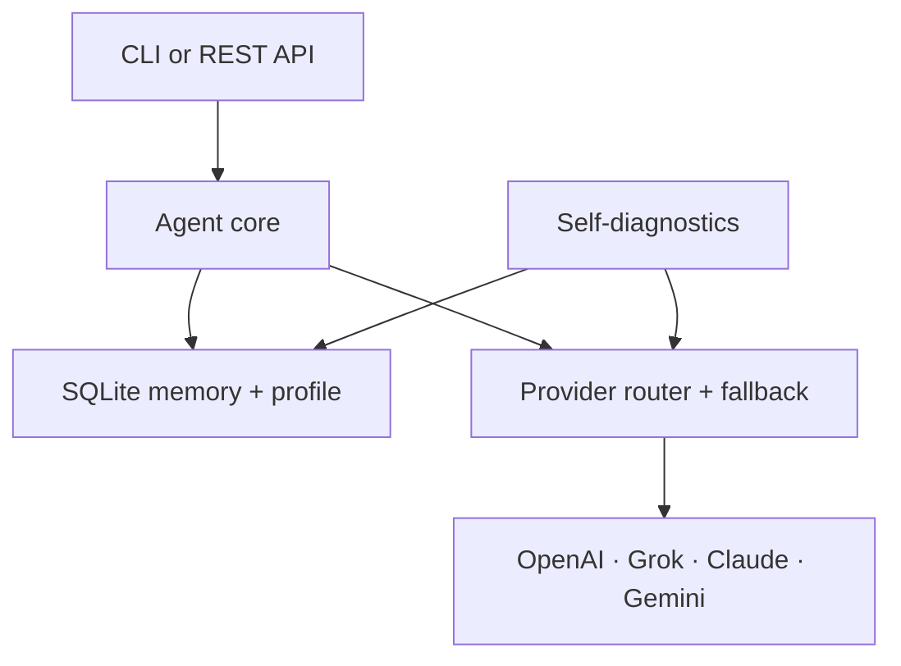

# Lemono Agent 🍋

Lemono is a local-first personal AI agent that remembers, checks its own health, and adapts to each user without silently rewriting its code or expanding its permissions.

## One-line install / 원라인 설치

macOS, Linux, WSL 터미널에서 아래 명령 하나로 설치하고 설정할 수 있습니다. Install and configure Lemono on macOS, Linux, or WSL with one command:

```bash
curl -fsSL https://raw.githubusercontent.com/mkseo1012-pixel/Lemono-Agent/main/scripts/install.sh | bash
```

설정을 다시 변경하려면 `lemono setup`을 실행하세요. Run `lemono setup` whenever you want to change providers, models, or API keys.

## MVP features

- **Multi-model routing:** OpenAI/Codex, xAI Grok, Anthropic Claude, and Google Gemini behind one interface
- **Durable memory:** local SQLite + FTS5 retrieval with user isolation, provenance, confidence, and complete deletion
- **Safe personal evolution:** learns only explicit preferences and injects the user profile on future turns
- **Self-diagnostics:** database, provider configuration, and disk checks via CLI or API
- **Resilience:** ordered provider fallback with bounded HTTP timeouts
- **Local-first security:** no telemetry, no shell tools, non-root hardened container, restricted CORS

The design takes inspiration from the public ideas behind Hermes Agent—persistent memory, learning loops, self-hosting, skills, gateways, and automation—while remaining an independent implementation. The current milestone deliberately focuses on a small, auditable core.

## 설치 방법 (한국어)

### 요구 사항

- Python 3.11 이상 또는 Docker
- OpenAI, xAI, Anthropic, Google 중 하나 이상의 API 키

### 로컬 설치

터미널 원 라이너(macOS, Linux, WSL):

```bash
curl -fsSL https://raw.githubusercontent.com/mkseo1012-pixel/Lemono-Agent/main/scripts/install.sh | bash
```

설치 과정에서 바로 모델 공급자와 API 키를 설정할 수 있습니다. 나중에 다시 설정하려면 `lemono setup`을 실행하세요. 다운로드할 스크립트를 먼저 검토하려면 URL을 브라우저에서 열거나 파일로 내려받은 뒤 실행하세요.

수동 설치:

```bash
git clone https://github.com/mkseo1012-pixel/Lemono-Agent.git
cd Lemono-Agent

python -m venv .venv
# macOS / Linux
source .venv/bin/activate
# Windows PowerShell: .venv\Scripts\Activate.ps1

pip install -e .
cp .env.example .env
```

`.env` 파일을 열어 사용할 공급자의 키를 하나 이상 입력하세요.

```dotenv
OPENAI_API_KEY=your_key_here
# XAI_API_KEY=your_key_here
# ANTHROPIC_API_KEY=your_key_here
# GEMINI_API_KEY=your_key_here
```

설정을 진단하고 CLI를 실행합니다.

```bash
lemono --doctor
lemono --provider openai
# 예: lemono --provider claude --model claude-sonnet-4-5
```

REST API 서버를 실행하려면:

```bash
uvicorn lemono.api:app --host 127.0.0.1 --port 8000
curl http://localhost:8000/v1/diagnostics
curl -X POST http://localhost:8000/v1/chat \
  -H 'content-type: application/json' \
  -d '{"user_id":"local","message":"답변은 간결하게 해줘"}'
```

API 문서는 `http://localhost:8000/docs`에서 볼 수 있습니다. 외부에 공개할 때는 반드시 인증 기능이 있는 리버스 프록시 뒤에 배치하세요.

### Docker로 설치

```bash
git clone https://github.com/mkseo1012-pixel/Lemono-Agent.git
cd Lemono-Agent
cp .env.example .env
# .env에 API 키를 입력한 다음 실행합니다.
docker compose up --build -d
curl http://localhost:8000/v1/diagnostics
```

중지하려면 `docker compose down`을 실행합니다. 기억 데이터는 `lemono-data` Docker 볼륨에 유지됩니다.

## Installation (English)

### Requirements

- Python 3.11 or newer, or Docker
- At least one API key from OpenAI, xAI, Anthropic, or Google

### Local installation

Terminal one-liner (macOS, Linux, and WSL):

```bash
curl -fsSL https://raw.githubusercontent.com/mkseo1012-pixel/Lemono-Agent/main/scripts/install.sh | bash
```

The installer can configure a model provider and API key immediately. Run `lemono setup` any time to change the configuration. If you prefer to audit downloaded scripts first, open the URL or download the file before running it.

Manual installation:

```bash
git clone https://github.com/mkseo1012-pixel/Lemono-Agent.git
cd Lemono-Agent

python -m venv .venv
# macOS / Linux
source .venv/bin/activate
# Windows PowerShell: .venv\Scripts\Activate.ps1

pip install -e .
cp .env.example .env
```

Open `.env` and add at least one provider key:

```dotenv
OPENAI_API_KEY=your_key_here
# XAI_API_KEY=your_key_here
# ANTHROPIC_API_KEY=your_key_here
# GEMINI_API_KEY=your_key_here
```

Check the installation and start the CLI:

```bash
lemono --doctor
lemono --provider openai
# Example: lemono --provider claude --model claude-sonnet-4-5
```

To run the REST API:

```bash
uvicorn lemono.api:app --host 127.0.0.1 --port 8000
curl http://localhost:8000/v1/diagnostics
curl -X POST http://localhost:8000/v1/chat \
  -H 'content-type: application/json' \
  -d '{"user_id":"local","message":"Keep the answer concise"}'
```

OpenAPI documentation is available at `http://localhost:8000/docs`. If you expose the service publicly, place it behind an authenticated reverse proxy.

### Docker installation

```bash
git clone https://github.com/mkseo1012-pixel/Lemono-Agent.git
cd Lemono-Agent
cp .env.example .env
# Add an API key to .env before starting.
docker compose up --build -d
curl http://localhost:8000/v1/diagnostics
```

Run `docker compose down` to stop the service. Memory remains in the `lemono-data` Docker volume.

## Provider configuration

| Provider | `provider` value | Key | Example default model |
|---|---|---|---|
| OpenAI / Codex | `openai` or `codex` | `OPENAI_API_KEY` | `gpt-5` |
| xAI | `grok` | `XAI_API_KEY` | `grok-4` |
| Anthropic | `claude` | `ANTHROPIC_API_KEY` | `claude-sonnet-4-5` |
| Google | `gemini` | `GEMINI_API_KEY` | `gemini-2.5-pro` |

Model names change over time; override them with `--model`, the chat request `model`, or `LEMONO_DEFAULT_MODEL`. `codex` currently uses OpenAI's standard API adapter; consumer ChatGPT subscriptions are not API credentials.

## Memory and privacy

Memories live at `~/.lemono/lemono.db` by default. Every row records its user, kind, source, confidence, and timestamp. Retrieval always filters by `user_id`. Delete one user's data with:

```bash
curl -X DELETE http://localhost:8000/v1/memories/local
```

The API has no built-in authentication in v0.1. Bind it only to localhost or put it behind an authenticated reverse proxy. Never commit `.env`.

## Architecture



Provider responses, remote content, and recalled memory are untrusted. The effect boundary owns authorization. Future tools must declare capabilities and require confirmation for destructive or external side effects.

## Roadmap

- v0.2: versioned `SKILL.md` registry and permission-gated tools
- v0.3: scheduler, Telegram/Discord gateways, streaming, and session summaries
- v0.4: sandboxed sub-agents, browser/MCP adapters, memory evaluation suite
- v1.0: encrypted secrets, auth/RBAC, migrations, observability, stable plugin SDK

## Development

```bash
pip install -e '.[dev]'
ruff check .
pytest -q
```

Contributions are welcome. Please keep provider-specific behavior behind adapters, add deterministic tests, and never log secrets or raw private memories.

## License

MIT
